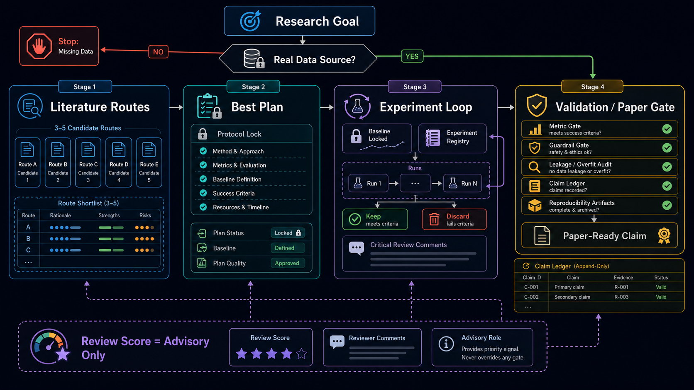

<p align="center">
  
</p>

<p align="center">
  <a href="LICENSE"></a>
  
  
  
  
</p>

<p align="center">
  <b>把自动化科研从“自动刷实验”变成“可验证、可复现、可写进论文的科研流程”。</b>
  <br />
  文献路线 · Baseline 锁定 · 实验注册表 · Claim Ledger · 泄漏审计 · 中文论文守门
</p>

<p align="center">
  <a href="#快速开始">快速开始</a>
  ·
  <a href="#工作流">工作流</a>
  ·
  <a href="#核心能力">核心能力</a>
  ·
  <a href="#和普通自动化科研脚本的区别">设计差异</a>
  ·
  <a href="#安装">安装</a>
</p>

## 这是什么

`autonomous-scientific-research` 是一个面向 Codex 的自动化科研工作流 skill。它用于辅助科学与工程方向的文献调研、研究路线比较、方案细化、实验执行、结果验证和论文写作。

它不是简单的“给 AI 一个目标然后自动跑实验”的提示词，而是一套带确认门、证据约束、实验审计和论文守门的科研流程控制器。

适合 AI、信号处理、生物医学、控制、材料、机械等需要真实数据、实验闭环和论文交付的研究项目。

## 为什么需要它

很多自动化科研流程看起来很快，但容易把科研做歪：

| 常见风险 | 后果 |
|---|---|
| 没有真实数据源就开始设计路线 | 方案看起来完整，但无法落地验证 |
| 只追单一指标或 review 分数 | 容易刷出不可复现或泄漏的高分 |
| 不锁定数据版本、split 和 baseline | 不同 run 之间不可比较 |
| 没有 claim ledger | 论文里写出的结论找不到证据来源 |
| 实验没验证完就写成贡献 | 论文表达流畅，但科研结论不成立 |

这个 skill 的核心目标是把这些风险前置：先确认数据和路线，再锁定协议，最后用指标、guardrail、泄漏审计和 claim ledger 判断结果是否真的成立。

## 工作流

<p align="center">
  
</p>

| 阶段 | 目标 | 关键产物 |
|---|---|---|
| Stage 0 | 问题定义和真实数据源 gate | 研究目标、约束、数据来源、成功标准 |
| Stage 1 | 文献综述和候选路线 | 经典论文、近 5-10 年进展、3-5 条候选路线 |
| Stage 2 | 最佳方案细化 | 方法设计、数据流、指标、baseline、消融和风险 |
| Stage 3 | 锁定协议下实验执行 | baseline、实验注册表、keep/discard、claim ledger |
| Stage 4 | 固定数据版本优化验证 | 指标门槛、guardrail、泄漏审计、最终可报告 claim |

Stage 1 和 Stage 2 必须等待用户确认。没有真实数据源或明确数据获取路径时，skill 不会直接生成空想方案、实验路线或结果图表。

## 核心能力

| 模块 | 解决的问题 | 输出 |
|---|---|---|
| 文献路线 | 避免只凭直觉选题 | 经典论文、近年进展、候选路线比较 |
| 实验协议 | 避免 run 与 run 不可比 | baseline、数据版本、split、primary metric、guardrail |
| 实验注册表 | 避免只记住成功结果 | 每次运行的 keep、discard、blocked、exploratory 记录 |
| Claim Ledger | 避免论文 claim 脱离证据 | 每个结论的证据、状态、限制和下一步 |
| 泄漏审计 | 避免刷出无效高分 | label leakage、test tuning、subject leakage、overfit 检查 |
| 写作守门 | 避免把未验证结果写成贡献 | 中文工程论文、图表叙述、claim-evidence 审核 |

## 亮点：Review 分数只能做诊断

这个 skill 专门加入了 review-score sanity control：

| Review 信号 | 处理方式 |
|---|---|
| 高 review 分数 | 不等于方法成立，仍需通过指标、guardrail 和泄漏审计 |
| 低 review 分数 | 不等于方法无效，先看评论是否指出真实技术缺陷 |
| validity-critical 评论 | 优先处理，会阻塞完成状态 |
| style-preference 评论 | 只能优化表达，不能覆盖证据和指标 |
| 分数提高但审计变差 | 分支应丢弃或标记为 exploratory |

最终完成状态必须同时考虑：

```text
metric gate
guardrail gate
leakage/overfit audit
claim ledger
reproducibility artifacts
critical reviewer comments
```

## 和普通自动化科研脚本的区别

| 普通自动化脚本 | 本 Skill |
|---|---|
| 直接开始跑实验 | 先过真实数据源 gate 和路线确认门 |
| 追求单一分数 | 同时检查指标、guardrail、泄漏、claim 和复现 |
| 只记录最好结果 | 每个 run 都进入实验注册表 |
| 失败分支容易丢失 | keep/discard/blocked/exploratory 都要有理由 |
| 论文写作靠润色 | 每个 claim 必须绑定证据或明确标成限制 |
| review 分数越高越好 | review 分数只作为诊断，不是唯一目标 |

## 快速开始

在 Codex 中可以这样触发：

```text
使用 autonomous-scientific-research，帮我围绕这个研究方向做 Stage 0 intake，并检查真实数据源、研究目标、约束和成功标准。
```

如果已经有数据和方向：

```text
使用 autonomous-scientific-research，基于我的数据和目标做 Stage 1 文献综述，给出 3-5 条候选研究路线，先不要实现，等我确认路线。
```

如果已经确认方案：

```text
使用 autonomous-scientific-research，按已确认的 Stage 2 方案启动 Stage 3，先锁定 baseline、数据版本、split、primary metric、guardrail 和 keep/discard 规则。
```

## 安装

将 skill 文件夹复制到 Codex 的 skills 目录：

```powershell
Copy-Item -Recurse .\autonomous-scientific-research "$env:USERPROFILE\.codex\skills\autonomous-scientific-research"
```

然后重启 Codex。

## Python 环境配置

如果需要执行科研代码，请配置 GPU Python 解释器路径：

```powershell
$env:AUTONOMOUS_RESEARCH_PYTHON="C:\Users\<you>\.conda\envs\GPU\python.exe"
```

也可以在系统环境变量或 shell 配置中持久化该变量。

如果没有设置 `AUTONOMOUS_RESEARCH_PYTHON`，而任务又需要运行 Python，skill 会要求先配置解释器，不会随意切换到其他环境。

## 目录结构

```text
autonomous-scientific-research/
├── SKILL.md
├── agents/
│   └── openai.yaml
├── references/
│   ├── workflow.md
│   ├── stage3-experiment-loop.md
│   ├── review-and-claim-integrity.md
│   ├── academic-writing.md
│   └── ...
└── scripts/
    └── init_stage3_registry.py
```

## 适合谁

- 想用 Codex 做科研项目管理、实验执行和论文整理的用户
- 需要把“文献路线 - 实验 - 结果 - 论文 claim”串起来的研究者
- 做 AI/机器学习、信号处理、生物医学、控制、材料、机械等方向的学生或工程研究人员
- 不想让自动化实验变成“刷高分但不可复现”的团队

## 不适合什么

- 没有真实数据源、数据集或明确数据获取路径的空想项目
- 只想让模型无限试错刷分、但不关心泄漏和验证的任务
- 需要伪造论文、实验、指标、引用或审稿意见的任务
- 只想做文字包装、不愿暴露未验证 claim 的论文写作

## 许可证

本项目采用 GNU General Public License v3.0 开源许可证，详见 [LICENSE](LICENSE)。

这意味着你可以使用、复制、修改和分发本项目，但如果你分发修改后的版本，也需要按照 GPL-3.0 的要求开放相应源代码并保留许可证说明。
